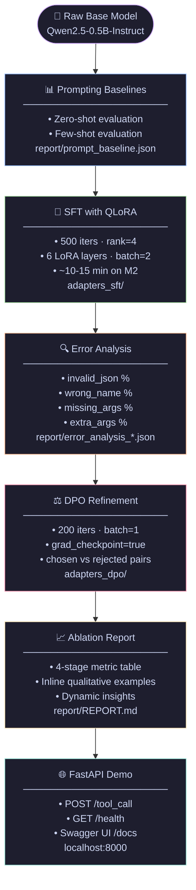

# 🧠 FineTuneFlow — Tool-Calling Alignment Pipeline (MLX)

<div align="center">
  
  
  
  
  
</div>

<br>

**FineTuneFlow** is an end-to-end LLM alignment pipeline engineered to run on constrained Apple Silicon hardware (M2 with 8GB RAM). It transforms a base Instruct model into a strict **Tool-Calling Agent** using a multi-stage training process — **Supervised Fine-Tuning (SFT)** via QLoRA followed by **Direct Preference Optimization (DPO)** — aligning model outputs to precise JSON schemas without any conversational hallucination.

---

## 🎯 Architecture & Pipeline



### Components

| Script | Purpose |
|---|---|
| `scripts/prepare_data.py` | Generates ChatML-formatted SFT dataset across 12 diverse tools |
| `scripts/prepare_dpo_data.py` | Builds chosen/rejected pairs via corruption strategies |
| `scripts/eval_baseline.py` | Evaluates all 4 stages with parse_rate, name_acc, arg_f1, exact_match |
| `scripts/analyze_errors.py` | Categorizes failure modes across base, SFT, and DPO outputs |
| `scripts/generate_report.py` | Generates full `REPORT.md` with ablation table and inline examples |
| `api/main.py` | FastAPI server with lazy-loading DPO → SFT → Base priority |

---

## 🚀 Getting Started

### Prerequisites
- macOS Apple Silicon (M1/M2/M3)
- Python 3.10+
- [`uv`](https://github.com/astral-sh/uv) — fast Python package manager

### Run the Full Pipeline

```bash
# 1. Bootstrap
make setup      # Create venv + install all deps
make data       # Generate 1000/100/200 SFT splits across 12 tools
make dpo-data   # Generate 300/50 DPO preference pairs

# 2. Baselines (downloads ~1GB model on first run)
make prompt-baseline   # Few-shot evaluation of raw base model
make baseline          # Zero-shot evaluation of raw base model

# 3. Supervised Fine-Tuning
make sft        # LoRA training, 500 iters (~10-15 min on M2)
make sft-eval   # Evaluate SFT adapter on 200-sample test set
make analyze    # Error breakdown: invalid JSON, wrong name, missing args

# 4. Preference Alignment
make dpo        # DPO refinement on chosen/rejected pairs
make dpo-eval   # Evaluate final DPO adapter

# 5. Report & Demo
make report     # Generate report/REPORT.md with full ablation table
make demo       # Launch FastAPI server at http://localhost:8000
```

**Full pipeline one-liner:**
```bash
make setup && make data && make dpo-data && \
make prompt-baseline && make baseline && \
make sft && make sft-eval && make analyze && \
make dpo && make dpo-eval && \
make report && make demo
```

---

## 🔌 API Reference

Once `make demo` is running:

### `POST /tool_call`
Generate a structured JSON tool call from a natural language query.

```bash
curl -X POST http://127.0.0.1:8000/tool_call \
  -H "Content-Type: application/json" \
  -d '{
    "query": "Book a flight from NYC to London tomorrow",
    "tools": [{
      "name": "book_flight",
      "description": "Book a commercial flight.",
      "parameters": {
        "type": "object",
        "properties": {
          "origin": {"type": "string"},
          "destination": {"type": "string"},
          "date": {"type": "string"}
        }
      }
    }]
  }'
```

**Response:**
```json
{
  "name": "book_flight",
  "arguments": {"origin": "NYC", "destination": "London", "date": "tomorrow"},
  "_meta": {"latency_ms": 712.4, "adapter": "dpo"}
}
```

### `GET /health`
```bash
curl http://127.0.0.1:8000/health
# {"status":"ok","model":"Qwen/Qwen2.5-0.5B-Instruct","adapter":"dpo"}
```

### Swagger UI
```
http://127.0.0.1:8000/docs
```

---

## 📊 Supported Tools (12 Categories)

The synthetic dataset covers a diverse range of real-world tool schemas:

| Tool | Description |
|---|---|
| `get_weather` | Current weather by city |
| `book_flight` | Flight booking with origin, destination, date |
| `calculate_mortgage` | Mortgage payment calculator |
| `search_restaurants` | Restaurant search by city and cuisine |
| `get_stock_price` | Real-time stock price by ticker |
| `translate_text` | Text translation between languages |
| `send_email` | Email with to, subject, body |
| `create_calendar_event` | Calendar event creation |
| `convert_currency` | Currency conversion |
| `play_music` | Music playback by song and artist |
| `set_reminder` | Task reminder at a specific time |
| `search_web` | Web search by query |

---

## 📈 Evaluation Metrics

All stages are evaluated on the same held-out 200-sample test set at greedy decoding (temp=0):

| Metric | Description |
|---|---|
| **Parse Rate** | % of outputs that parse as valid `{"name":..., "arguments":...}` dicts |
| **Name Accuracy** | % of outputs calling the correct function |
| **Arg F1** | F1 score on `(key, value)` argument pairs |
| **Exact Match** | % of outputs perfectly matching name + all arguments |

Results are compiled into `report/REPORT.md` with a full ablation table and inline qualitative examples comparing Base → SFT → DPO outputs.

---

## ⚠️ Hardware Constraints

Designed strictly for 8GB unified RAM:

| Setting | Value |
|---|---|
| Model | `Qwen/Qwen2.5-0.5B-Instruct` |
| SFT batch size | `2` |
| DPO batch size | `1` (with gradient checkpointing) |
| LoRA rank | `4` |
| LoRA layers | `6` |
| Max sequence length | `512` (DPO), `2048` (SFT) |
| Eval temperature | `0` (greedy decoding) |

---

## 🧠 Key Learnings

- **Why LoRA works**: Low-rank adaptation injects task-specific structure into a frozen base model with minimal parameters (~0.6% trainable), fitting entirely in 8GB RAM.
- **Why DPO > RLHF for small setups**: DPO directly optimizes from paired examples with no separate reward model, making it stable and memory-efficient on consumer hardware.
- **Why on-policy data matters**: Using the model's own failure modes as rejected pairs ensures the DPO signal stays within the model's distribution, maximizing data efficiency.
